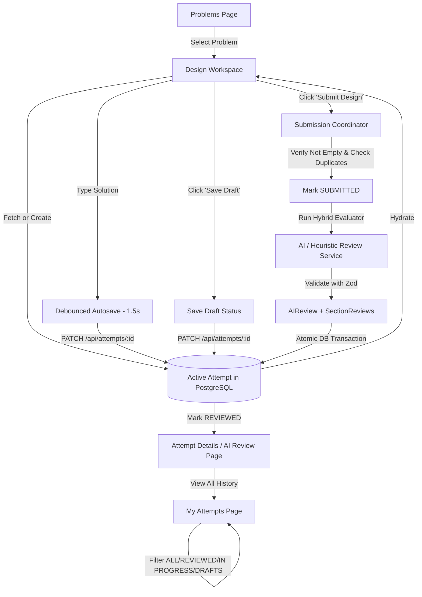

# DesignForge — LLD Practice & Evaluation Platform

DesignForge is an interactive Low-Level Design (LLD) practice platform engineered to help software developers transition from memorizing design patterns to reasoning critically about object modeling, state coordination, and architectural trade-offs.

---

## Table of Contents

- [Overview](#overview)
- [The Problem Being Solved](#the-problem-being-solved)
- [MVP Scope & Problems](#mvp-scope--problems)
- [Architecture & Tech Stack](#architecture--tech-stack)
- [Application Flow](#application-flow)
- [Database Design](#database-design)
- [AI Evaluation & Hybrid Scoring](#ai-evaluation--hybrid-scoring)
- [Environment Variables](#environment-variables)
- [Setup & Local Development](#setup--local-development)
- [Testing](#testing)
- [Architectural Trade-offs](#architectural-trade-offs)
- [Documentation Index](#documentation-index)

---

## Overview

Unlike algorithmic coding challenges where correctness is binary (pass/fail test cases), Low-Level Design involves open-ended modeling where multiple valid solutions exist with distinct trade-offs. DesignForge provides:
- Structured problem briefs with clear constraints and requirements.
- Modular workspaces where users document domain entities, relationships, state machines, and design rationales.
- Continuous autosave and draft persistence.
- Explainable, multi-dimensional feedback combining deterministic domain validation with AI reasoning.
- Historical attempt tracking to measure design progression over time.

---

## The Problem Being Solved

Traditional system design practice suffers from key deficiencies:
1. **Unstructured Thinking:** Candidates jump straight into coding or drawing without isolating responsibilities, relationships, or state boundaries.
2. **Vague Feedback:** Existing AI platforms output generic praise or superficial critiques ("looks good!").
3. **Loss of Context:** Practice attempts are scattered in note apps without a structured record of previous architectural decisions.

DesignForge structures the design workflow into focused sections and delivers section-by-section, rubric-grounded evaluation.

---

## MVP Scope & Problems

The MVP includes four foundational LLD problems with domain-specific sections and rubrics:

1. **Parking Lot** (`parking-lot` — Easy · ~45 min)
   - *Focus:* Responsibilities & Object Relationships
   - *Sections:* Classes & Responsibilities, Object Relationships, Design Decisions
2. **Elevator System** (`elevator-system` — Medium · ~60 min)
   - *Focus:* State Management & Fleet Coordination
   - *Sections:* Core Entities, Elevator States, Request Flow, Dispatch / Scheduling
3. **Vending Machine** (`vending-machine` — Medium · ~45 min)
   - *Focus:* State Transitions & Extensibility
   - *Sections:* Core Objects, States & Transitions, Payment Strategy, Design for Extensibility
4. **Library Management** (`library-management` — Easy · ~45 min)
   - *Focus:* Domain Modelling & Abstraction
   - *Sections:* Domain Entities, Responsibilities, Relationships, Abstractions & Extensibility

---

## Architecture & Tech Stack

DesignForge is built as a clean Next.js monolith following domain-driven service boundaries:

- **Framework:** Next.js 16 (App Router, Server Actions & Route Handlers)
- **Language:** TypeScript 5.7 (Strict Mode)
- **Database:** PostgreSQL (Relational schema with Prisma ORM 6.4)
- **Validation:** Zod 4 for input and structured AI schema validation
- **Styling:** Vanilla CSS design tokens with Tailwind CSS utility support
- **Testing:** Vitest 5 with fast isolated test execution
- **AI Integration:** Multi-provider abstraction (`lib/services/ai-evaluator.ts`) supporting deterministic offline evaluation, Google Gemini, and OpenAI.

### Directory Structure

```
├── app/
│   ├── api/
│   │   ├── attempts/          # Attempt creation, response autosave & submission
│   │   └── problems/          # Problem catalogue & section metadata
│   ├── attempts/              # My Attempts listing and detailed review pages
│   ├── practice/[slug]/       # Problem briefs and interactive workspace
│   ├── globals.css            # Curated DesignForge design system
│   ├── layout.tsx             # Root layout and font hierarchy
│   └── page.tsx               # Problem catalogue landing page
├── components/
│   ├── attempts-pages.tsx     # Attempts history & detailed review UI
│   ├── practice-pages.tsx     # Workspace, autosave debouncing & submission
│   └── problems-page.tsx      # Problem list & difficulty filter UI
├── lib/
│   ├── db/prisma.ts           # Prisma client singleton
│   ├── services/
│   │   ├── ai-evaluator.ts    # AI evaluation abstraction & deterministic engine
│   │   ├── attempt-service.ts # Attempt lifecycle, queries & updates
│   │   ├── evaluation-service.ts # Submission coordinator & DB transactions
│   │   └── problem-service.ts # Problem catalog queries
│   └── validation/schemas.ts  # Zod validation schemas
├── prisma/
│   ├── schema.prisma          # Relational database schema
│   └── seed.ts                # Idempotent problem & section seed script
├── tests/                     # Unit and integration test suites
└── vitest.config.mts          # Test configuration
```

---

## Application Flow



---

## Database Design

The relational schema strictly maps core entities with proper foreign keys, cascading deletions, and indexes:

- **`User`**: Optional user account entity for personalization.
- **`Problem`**: Slug, title, difficulty, estimated time, focus, requirements array.
- **`ProblemSection`**: Ordered sections per problem with description, placeholder, and LLD evaluation criteria.
- **`Attempt`**: Links user/session to problem with status (`DRAFT`, `IN_PROGRESS`, `SUBMITTED`, `REVIEWED`, `FAILED`), overall score, and timestamps.
- **`AttemptResponse`**: Stores response text mapped to section ID and attempt ID.
- **`AIReview`**: 1-to-1 with Attempt; stores overall score, qualitative assessment, design summary, strengths, improvements, and next challenge recommendation.
- **`SectionReview`**: Stores section-level score (0–10) and granular feedback.

---

## AI Evaluation & Hybrid Scoring

To ensure explainable and reliable feedback without relying solely on arbitrary LLM outputs, DesignForge uses a **hybrid evaluation model**:

1. **Deterministic Input Checks:** Prevents empty submissions, verifies basic length and section coverage.
2. **Provider Abstraction:** The `AIEvaluator` interface decouples the application from concrete AI SDKs:
   - **`DeterministicRuleEvaluator` (Default):** Runs offline, evaluating domain concepts, relationships, state modeling, and trade-offs against each section's specific criteria.
   - **`GeminiAIEvaluator`:** Invoked when `AI_PROVIDER="gemini"` and `GEMINI_API_KEY` is provided.
   - **`OpenAIEvaluator`:** Invoked when `AI_PROVIDER="openai"` and `OPENAI_API_KEY` is provided.
3. **Structured Output Validation:** All evaluation outputs are validated at runtime against `AIReviewOutputSchema` using Zod before persistence. Raw or unvalidated LLM output is never stored.
4. **Resilient Failure Handling:** If AI evaluation encounters network failure or invalid output, user responses remain safely preserved, and the attempt status is marked appropriately so the evaluation can be retried.

---

## Environment Variables

Copy `.env.example` to `.env`:

```bash
cp .env.example .env
```

| Variable | Required | Default | Description |
|---|---|---|---|
| `DATABASE_URL` | Yes | `postgresql://localhost:5432/designforge?schema=public` | PostgreSQL connection string |
| `AI_PROVIDER` | No | `"mock"` | Options: `"mock"` (deterministic offline), `"gemini"`, `"openai"` |
| `GEMINI_API_KEY`| Optional| `""` | Google Gemini API key (if `AI_PROVIDER="gemini"`) |
| `OPENAI_API_KEY`| Optional| `""` | OpenAI API key (if `AI_PROVIDER="openai"`) |

---

## Setup & Local Development

### Prerequisites

- Node.js 20+ or 24+
- PostgreSQL running locally or via Docker
- `pnpm` (v10)

### 1. Install Dependencies

```bash
pnpm install
```

### 2. Configure Database

Ensure PostgreSQL has a database named `designforge`:

```bash
psql -d postgres -c "CREATE DATABASE designforge;"
```

Push schema to PostgreSQL:

```bash
pnpm exec prisma db push
```

### 3. Seed Initial Problems

Seed the 4 MVP problems and their evaluation criteria:

```bash
pnpm run seed
```

### 4. Start Development Server

```bash
pnpm dev
```

Open [http://localhost:3000](http://localhost:3000) in your browser.

---

## Testing

DesignForge includes an automated test suite verifying input validation, AI output conformance, scoring logic, attempt lifecycle, and duplicate submission protections.

Run tests:

```bash
pnpm test
```

Typecheck:

```bash
pnpm exec tsc --noEmit
```

---

## Architectural Trade-offs

1. **Monolith vs Microservices:** Built as a monolithic Next.js application to eliminate network overhead, deployment complexity, and distributed state coordination.
2. **Debounced Autosave (1500ms):** Balances database write frequency with responsive data durability, accompanied by subtle inline status cues rather than intrusive toasts.
3. **Hybrid Evaluator:** Guarantees deterministic, reproducible evaluations out-of-the-box while enabling seamless pluggability for frontier LLMs through a clean interface.
4. **Strict Schema Constraints:** Avoids freeform schema-less tables in favor of typed relational entities with JSON fields reserved for variable-length feedback arrays.

---

## Documentation Index

- [AI Usage & Limitations](file:///Users/karanthakur/Downloads/design-forge/AI_USAGE.md)
- [Research Note](file:///Users/karanthakur/Downloads/design-forge/RESEARCH_NOTE.md)
- [Design Note](file:///Users/karanthakur/Downloads/design-forge/DESIGN_NOTE.md)
